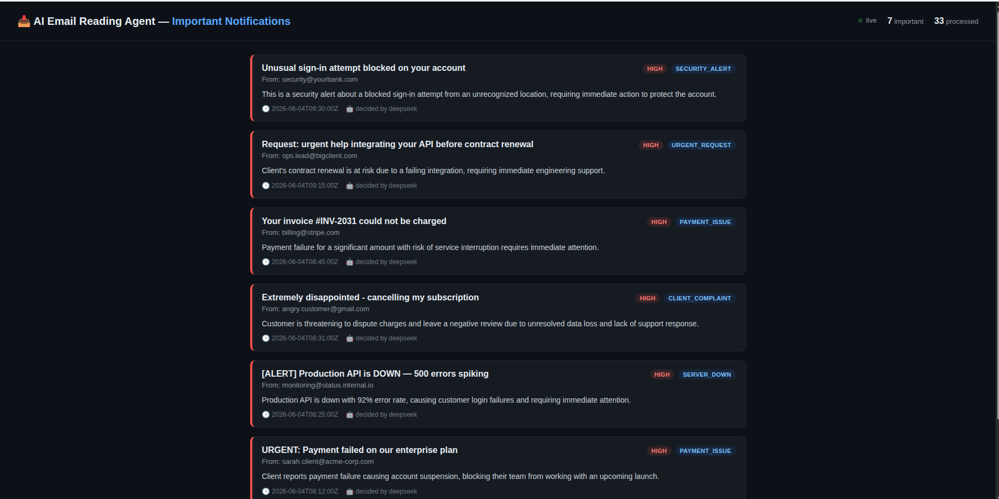

# AI Email Reading Agent

An AI agent that continuously reads an inbox, decides whether each email is
**important**, and surfaces only the important ones as notifications on a live
dashboard. Non-important emails are silently ignored, and the same email is
never shown twice.

Built for the TQTech *Software Engineer 2 — AI Automation Engineer* task.



*The dashboard — only important emails appear, colour-coded by priority, each
with sender, subject, priority, category, the AI's reason, and time received.*

---

## What it does (end to end)

1. The **agent** polls an inbox on a fixed interval (mock data or Gmail).
2. For every email it reads the subject + body and produces a **structured decision**:
   `important` (true/false), `priority` (HIGH/MEDIUM/LOW), `category`
   (e.g. `PAYMENT_ISSUE`), and a one-sentence `reason`.
3. If important, the email is stored and appears on the **dashboard** as a card.
4. If not important, it is ignored — nothing is shown.
5. Every processed email ID is recorded in SQLite, so **no email is ever shown twice**.

---

## Quick start

### Run with Docker (the required way)

```bash
docker compose up --build
```

Then open **http://localhost:8000**.

That's it — it runs in **mock mode** by default (reads `data/mock_emails.json`),
so it works with **no credentials and no API key**. The agent and the dashboard
start as two services sharing one SQLite volume.

### Run locally with uv (for development)

```bash
uv sync
cp .env.example .env          # optional — defaults already work in mock mode
```

The agent and dashboard are **two separate processes** (just like the two Docker
services), so run them in two terminals from the project root:

```bash
# Terminal 1 — the agent (fetches + classifies, writes to SQLite)
uv run python -m app.agent

# Terminal 2 — the dashboard (reads SQLite, serves the UI)
uv run uvicorn app.dashboard:app --port 8000
```

Then open **http://localhost:8000**. Configuration is read from `.env`; no
inline env vars are needed.

> Why two processes? The agent does the work; the dashboard only displays. They
> communicate through the shared SQLite database. If the dashboard shows
> *"0 processed"*, the agent isn't running.

---

## Deploy on Render (live demo link)

Render's free tier has no background workers and no shared disk between
services, so the two-service model doesn't fit. Instead, the agent runs **inside
the web service** as a background thread, enabled by `RUN_AGENT_IN_PROCESS=1`.
One process does both jobs and SQLite works in the same container. A
[`render.yaml`](render.yaml) Blueprint is included.

1. Push this repo to GitHub.
2. In Render: **New → Blueprint** → select the repo. It reads `render.yaml` and
   creates one **Web Service** (free plan).
3. Set the secret env vars in the Render UI (they're marked `sync: false` so they
   are *never* stored in the repo): `DEEPSEEK_API_KEY`, and `GMAIL_USER` /
   `GMAIL_APP_PASSWORD` if you switch `EMAIL_SOURCE` to `gmail`.
4. Deploy → open the Render URL. The dashboard loads and the in-process agent
   fills it within one poll cycle.

**Build:** `pip install uv && uv sync --frozen`
**Start:** `uv run uvicorn app.dashboard:app --host 0.0.0.0 --port $PORT`

> Notes: SQLite is **ephemeral** on free Render (resets on redeploy / spin-down) —
> fine here, since mock data repopulates each cycle. Free web services also sleep
> after ~15 min idle and cold-start on the next visit, pausing the agent until
> then. For always-on persistence, use a paid plan with a managed Postgres and
> swap the small `app/db.py` layer.

---

## How the AI works (the heart of the system)

The classifier is a **hybrid**: a deterministic rule-based engine with an
optional DeepSeek LLM layer on top.

```
email ──▶ rule-based classifier (always runs, no creds)
            │
            ├─ DEEPSEEK_API_KEY set?  ──▶ DeepSeek refines the decision
            │                              (valid JSON?  use it)
            └─ otherwise / on failure  ──▶ keep the rule-based decision
```

### 1. Rule-based engine (`app/classifier/rules.py`)
Scores each email across weighted signal groups:

| Category | Example signals |
|---|---|
| `PAYMENT_ISSUE` | "payment failed", "invoice", "card declined", "refund" |
| `SERVER_DOWN` | "is down", "outage", "500 error", "cannot log in" |
| `CLIENT_COMPLAINT` | "disappointed", "cancelling", "nobody has replied" |
| `URGENT_REQUEST` | "urgent", "asap", "blocking", "deadline" |
| `SECURITY_ALERT` | "unusual sign-in", "password reset", "suspicious" |

Noise signals (`unsubscribe`, `newsletter`, `% off`, `no-reply@` senders…)
subtract from the score. The total maps to a priority (`HIGH ≥ 5`,
`MEDIUM ≥ 2`, `LOW ≥ 1`) and the highest-scoring category wins the label.
This runs **fully offline**, which is why mock mode never needs a key.

### 2. DeepSeek refinement (`app/classifier/deepseek.py`)
DeepSeek exposes an **OpenAI-compatible API**, so the project uses the `openai`
SDK pointed at `https://api.deepseek.com`. When `DEEPSEEK_API_KEY` is set, each
email is sent with a strict prompt that forces a JSON decision. The LLM handles
nuance the rules miss (sarcasm, negation like *"no action urgently needed"*,
unusual phrasing). If the key is missing or the call fails, the agent
**falls back to the rule-based result** — it never breaks.

To enable it, set in `.env`:
```
DEEPSEEK_API_KEY=sk-...
```

---

## How the dashboard works

A **FastAPI** service (`app/dashboard.py`) serves:

- `GET /` — an auto-refreshing HTML page (polls every 5s).
- `GET /api/notifications` — JSON feed of important emails + stats.
- `GET /healthz` — health check.

Each notification card shows everything the task requires:
**Sender · Subject · Priority · Category · Reason · Time received** (plus which
engine decided — `rules` or `deepseek`). Cards are colour-coded by priority and
sorted HIGH → LOW.

---

## Email sources

Set `EMAIL_SOURCE` in `.env` to one of:

| Value | Reads from | Credentials |
|---|---|---|
| `mock` *(default)* | `data/mock_emails.json` | none |
| `gmail` | Gmail (`imap.gmail.com`) | `GMAIL_USER`, `GMAIL_APP_PASSWORD` |

**Reading only — there is no SMTP anywhere.** SMTP *sends* mail; this agent only
*reads*. Gmail is read over IMAP at `imap.gmail.com` using a
[Google App Password](https://myaccount.google.com/apppasswords) (requires
2-Step Verification — use the app password, never your real password).

**Non-destructive by design.** The Gmail reader opens the mailbox `readonly` and
fetches with `BODY.PEEK`, so it **never marks your real emails as read** or
changes your inbox in any way. To avoid hammering a large inbox, each poll only
processes the **newest `GMAIL_MAX_FETCH` unread** messages (default 20);
duplicate prevention then ensures each is shown only once.

---

## Duplicate prevention

Every processed email ID is written to a `processed_emails` table in **SQLite**.
Before classifying, the agent checks this table and skips anything already seen,
so an email is processed — and shown — exactly once, even across restarts (the
DB lives on a Docker volume). For Gmail the stable `Message-ID` header is used
as the key; mock emails carry explicit IDs.

---

## Scheduling

The agent loops forever, sleeping `POLL_INTERVAL` seconds (default **120**)
between polls. Set it in `.env`.

---

## Configuration (`.env`)

Copy `.env.example` → `.env` and edit. Every variable is documented in the file.

| Variable | Purpose | Default |
|---|---|---|
| `EMAIL_SOURCE` | `mock` or `gmail` | `mock` |
| `POLL_INTERVAL` | seconds between inbox polls | `120` |
| `DEEPSEEK_API_KEY` | enables DeepSeek AI layer (optional) | *(empty → rules only)* |
| `DEEPSEEK_BASE_URL` / `DEEPSEEK_MODEL` | DeepSeek endpoint + model | `https://api.deepseek.com` / `deepseek-chat` |
| `GMAIL_USER` / `GMAIL_APP_PASSWORD` | Gmail credentials (when `EMAIL_SOURCE=gmail`) | — |
| `IMAP_FOLDER` | Gmail mailbox/label to read | `INBOX` |
| `GMAIL_MAX_FETCH` | newest unread emails processed per cycle | `20` |
| `DB_PATH` | SQLite path (Compose overrides to the shared volume) | `data/agent.db` |
| `RUN_AGENT_IN_PROCESS` | run the agent loop inside the dashboard (single-service deploys like Render) | *(unset)* |

> **Never commit real secrets.** `.env` is git-ignored; only `.env.example`
> (with empty values) is tracked.

---

## Project structure

```
email-reading-agent/
├── docker-compose.yml      # agent + dashboard, shared SQLite volume
├── Dockerfile              # uv-based build
├── pyproject.toml / uv.lock
├── .env.example
├── image/image-1.png       # dashboard screenshot (used in this README)
├── data/mock_emails.json   # mandatory mock dataset
└── app/
    ├── models.py           # Email + Decision
    ├── db.py               # SQLite: dedup ledger + notifications feed
    ├── agent.py            # poll loop: fetch → dedup → classify → store
    ├── dashboard.py        # FastAPI UI + JSON API
    ├── sources/            # base.py, mock.py, gmail.py (mock | gmail)
    └── classifier/         # rules.py, deepseek.py, hybrid.py
```

---

## Limitations & possible improvements

- **Rule-based corner cases.** Pure keyword matching can over-flag (e.g. a
  *"no action urgently needed"* reminder still matches "urgent"). The DeepSeek
  layer resolves these; without a key, expect occasional benign false positives.
- **Gmail reads only the newest `GMAIL_MAX_FETCH` unread emails per cycle.** A
  very old important email buried below that window won't surface; raise the
  limit if needed. Reading is non-destructive (read-only / `BODY.PEEK`), and
  SQLite is the source of truth for "already shown".
- **No auth on the dashboard.** It's a read-only demo UI; add auth before any
  real deployment.
- **SQLite** is ideal for a single-node demo. For higher throughput swap the
  `db.py` layer for PostgreSQL/Redis — the interface is small.
- DeepSeek is called one email at a time; batching would cut latency/cost at scale.
